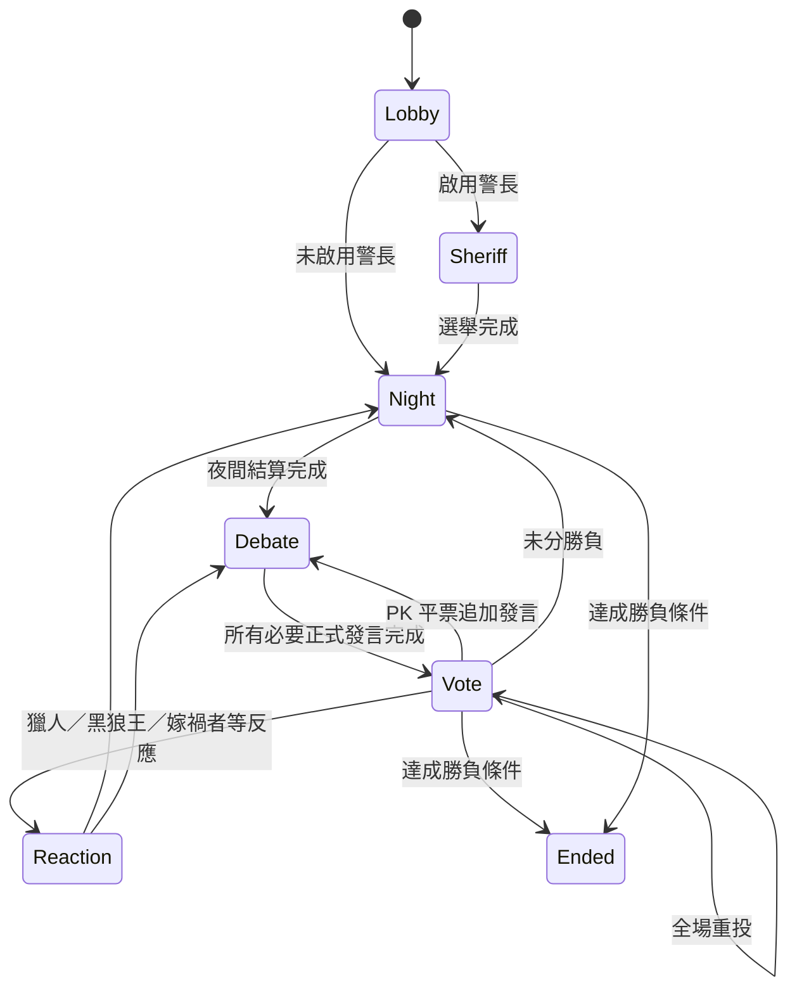

# 狼人殺 — Cloudflare Workers 辯論式狼人殺

**狼人殺**是一個部署於 Cloudflare Workers 的即時多人狼人殺 Web App。每個房間由一個 Durable Object 維護 authoritative state，前端使用 WebSocket 即時同步。

本專案只有一個玩法核心：**辯論式，不做暴民式。**

- 夜晚：角色秘密行動。
- 白天：公開資訊 → 依序正式發言 → 投票。
- 自由聊天不等於正式發言，也不能跳過 Debate Gate。
- 不實作武器、追逐、碰撞、距離、跑速、盔甲、隱形偷襲等 Minecraft 暴民式機制。
- 原作中只存在暴民式效果的角色仍保留角色名稱，但改寫為資訊／狀態機效果。

---

## 1. 房間與人物登入

房間可直接用 URL 分享：

```text
https://your-worker.example/ABC234
```

規則：

- 房號全域唯一，由伺服器產生 6 碼代碼。
- 房間密碼為**可選**。
- 真人「人物密碼」為**必填**，最少 4 個字元。
- 同一房間內名稱經 Unicode NFKC、空白正規化與不分大小寫比較後不可重複。
- 瀏覽器 session 還有效時重新整理會直接恢復人物。
- session 遺失、換瀏覽器或換裝置時，可用「房號 + 人物名稱 + 人物密碼」重新登入同一個人物。
- 成功重新登入會 rotate session token，舊連線立即失效。
- 房主踢人不是永久 Ban；名稱會釋放。對局進行中重新加入者只能觀戰，下一局才回到正式玩家，避免重新抽角色作弊。
- 升級前建立、尚未有人物密碼的舊人物，只要既有 token 還有效，UI 會要求補設人物密碼。

人物與房間密碼只保存 PBKDF2 verifier，不保存明碼。

---

## 2. 辯論式狀態機



房主可以設定：

- 警長選舉開關。
- 死亡資訊：隱藏、只顯示死者、顯示死因。
- 平票：無人出局、全場重投、平票玩家 PK 正式發言後重投。
- 角色配置可勾選「自動配置角色」；啟用後伺服器會依正式玩家數重算基本板子，玩家加入／離開與開局前都會重新對齊。取消勾選後才可手動調整完整 114 角色。

警長首輪平票會進第二輪；第二輪仍平票則本局無警長。現任警長死亡後，依得票候補順位由仍存活者繼任。警長的放逐票計為 2 票。

---

## 3. 角色系統

角色系統由 `src/roles.ts` 的資料驅動 Registry 管理，目前共有 **114 個 canonical 角色**。角色可重複配置，不再限制「特殊角色只能一名」。完整角色表見 `docs/ROLE_CATALOG.md`。

依目前採用的酷米主表分類，邱比特、抖M教徒、抖S教主的 **base faction 仍是好人陣營**；「戀人」是配對後的關係狀態，不等於把這三個角色本身固定改成第三方。

角色來源分三類：

- `official`：使用者提供的酷米狼人殺主文角色。
- `discussion`：同頁留言／後續角色提案。
- `adapted`：原效果主要依賴 Minecraft 暴民式物理互動，因此保留角色並明確改成辯論式資訊／狀態效果。

測試會鎖定 114 個 canonical IDs，且每一個 `adapted` 角色都必須有 `debateAdaptation` 說明；角色 Registry 中出現的每個主動 `effect` 也必須存在 server resolver 或核心技能路徑。

開局條件：

- 至少 3 名正式玩家。
- 配置角色總數必須等於正式玩家數。
- 至少一名狼人陣營。
- 開局狼人陣營數必須少於其他正式玩家總數。

應用程式不再設定固定最大玩家數；實際容量仍受 Cloudflare Durable Objects / WebSocket / CPU / memory / storage 平台限制。

---

## 4. 特殊資訊與結算

目前引擎包含：

- 狼刀、守護、女巫藥、查驗與偽裝。
- 雪狼／次雪狼／詐欺師／百變狼／潛伏狼等查驗干擾。
- 獵人、黑狼王、嫁禍者等 Reaction phase。
- 戀人、替身、肉盾、夢遊者、延遲死亡、復活、角色交換與陣營轉換。
- 怨靈、血族與第三方特殊勝負。
- 烏鴉票、抖M無效票、辨別者條件票、炸彈票、暴走狼累積票權。
- 警長與候補繼任。
- PK 辯論重投。
- 角色重複出現時的死亡反應 queue。

伺服器始終保存 canonical state；瀏覽器只收到該人物依法可知的 projection。

---

## 5. 公開聊天與正式發言

公開聊天與正式辯論分離：

- `chat`：自由交流，不推進發言順位。
- `speech`：只有目前輪到的玩家可以送出，送出後才推進 Debate Gate。
- 夜晚關閉公開聊天。
- 出局者與進行中觀戰者不能向存活玩家公開發言。
- 船長依角色設定知道全角色，但不進正式發言順序。

### 三語與即時翻譯

- UI 支援 `zh-TW`（繁體中文）、`zh-CN`（简体中文）、`en`（English），選擇會保存在瀏覽器。
- UI、114 個角色名稱／說明／辯論改寫、系統訊息、遊戲規則、技能與固定錯誤文字使用 repository 內固定三語翻譯；這些內容不送 Google、MyMemory 或生成式 AI。
- 玩家送出的 `chat` 與 `speech` 保留原文。真人自由文字不把「介面語言」當成文字來源語言，而由上游翻譯以 `sl=auto` 自動偵測；已知來源語言的 AI 發言仍可附 source locale。
- 只有觀看者需要跨語言顯示玩家自由文字時，前端才透過已登入房間的 `/api/rooms/:roomId/translate` 端點請求翻譯。翻譯失敗時顯示原文與可見失敗狀態，不把原文永久 cache 成成功翻譯，也不阻塞遊戲流程。
- Worker 的 Google 主路徑照使用者提供的 Userscript：`https://translate.googleapis.com/translate_a/single?client=gtx&sl=auto&tl=...&dt=t&q=...`。
- Google 先發送；若尚未快速得到可用結果，180ms 後可啟動 MyMemory 短文字備援。MyMemory 先完成時再保留 140ms 的 Google 優先等待窗。
- MyMemory 備援只處理 UTF-8 不超過 500 bytes 的短文字。
- 翻譯端點要求有效房間 session，並限制單次筆數、單筆長度與總文字長度，避免成為公開無限制翻譯代理。
- 這條聊天翻譯鏈路**不是 Google Cloud Translation Basic v2**，不需要 `GOOGLE_TRANSLATE_API_KEYS`、Google Cloud Project、Billing 或翻譯 Worker Secret，也不使用 ChatGPT／Gemini 等生成式 AI。
- `translate.googleapis.com` 的 `client=gtx` 路徑不是 Google Cloud Translation 公開 API；上游若改動、限流或失效，聊天翻譯可能暫時不可用。完整規則見 `docs/I18N_POLICY.md`。

### 管理後台與房內管理員

- `/admin` 是全站管理後台；API 使用 Worker Secret `ADMIN_PANEL_TOKENS` 的 Bearer Token 驗證，Token 只保存在管理者瀏覽器的 `sessionStorage`。
- 後台可看已追蹤房間總數、房號、階段、玩家數、房主／房內管理員、聊天翻譯服務狀態，以及最近的 API／翻譯／AI／WebSocket 去敏錯誤。
- 後台可以進入單一房間檢視、發系統公告、踢出玩家、指定或移除房內管理員；不會顯示人物密碼 verifier、session token、管理員 Token 或玩家 BYOK AI Key。
- 房主可以指定「房內管理員」。房內管理員目前只取得秩序管理權（例如踢出一般玩家），不能取代房主開始／重開遊戲，也不能修改角色配置與房規；房內管理員不能踢房主或其他房內管理員。
- 全房間清單由獨立 `RoomDirectory` Durable Object 登記。部署此版本後新建或再次被存取的房間會自動出現在後台；部署前已存在但之後完全沒有流量的休眠房間無法從 Durable Object namespace 反向列舉，可在後台輸入已知房號補登記。

---

## 6. 遊戲 AI：完全選用 + BYOK

純真人房不需要任何 AI Provider。

若房主加入 AI：

1. 選 Provider / Model。
2. 每個 AI 可輸入 **1~8 組 API Key**；Key pool 只放在房主目前瀏覽器 `sessionStorage`。
3. AI 輪到操作時，房主瀏覽器把該 AI 的 Key pool 隨該次 `/ai/run` request 傳給 Worker。
4. Provider 回傳無效憑證、配額／限流或暫時性錯誤時，Worker 才依序切換下一組 Key；遊戲規則錯誤與合法性錯誤不會靠換 Key 重試。
5. Durable Object 不把 Key 寫進 room state / SQLite / repository / Worker Secrets。
6. 分頁工作階段結束後必須重新輸入。

AI 正式發言同時可回傳可選的 **結構化白天技能 action**。例如白狼王真的要自爆時必須回傳符合當前角色技能的 `effect/targetIds/option`；伺服器會再以 `roleActionPrompt`、合法目標與 target count 驗證。單純在發言文字提到「自爆／決鬥」不會觸發技能，避免誤判。

支援 OpenAI、Gemini、DeepSeek 與 HTTPS OpenAI-compatible endpoint。

---

## 7. 專案結構

```text
.
├─ public/
│  ├─ index.html
│  ├─ admin.html
│  ├─ admin.js
│  ├─ styles.css
│  ├─ admin.css
│  ├─ i18n.js
│  ├─ game-i18n.js
│  ├─ role-name-i18n.js
│  ├─ ui-fixes.css
│  ├─ ui-fixes.js
│  └─ app.js
├─ src/
│  ├─ index.ts
│  ├─ room.ts
│  ├─ room-directory.ts
│  ├─ admin.ts
│  ├─ game-engine.ts
│  ├─ roles.ts
│  ├─ auth.ts
│  ├─ translate.ts
│  ├─ ai.ts
│  └─ types.ts
├─ docs/
│  ├─ ROLE_CATALOG.md
│  └─ I18N_POLICY.md
├─ test/
│  ├─ game-engine.test.mjs
│  ├─ translation.test.mjs
│  ├─ admin.test.mjs
│  └─ i18n-static.test.mjs
├─ .github/workflows/verify.yml
├─ SECURITY.md
├─ wrangler.jsonc
└─ package.json
```

---

## 8. 本機開發與驗證

需求：Node.js 22。

```bash
npm ci
npm run cf-typegen
npm run dev
```

完整驗證：

```bash
npm run verify
```

等價核心 Gate：

```bash
npm test
npm run typecheck
npx wrangler deploy --dry-run --outdir .wrangler-dry-run
```

---

## 9. 部署

```bash
npx wrangler login
npx wrangler deploy
```

也可使用 Cloudflare Workers Builds 連接 GitHub，Production branch 指向 `main`。

本 repository 不需要部署者提供共享**遊戲 AI** API Key；遊戲 AI 仍由房主 BYOK。玩家 `chat` / `speech` 翻譯也不需要 Google Cloud Translation API Key 或 Worker Secret，因此不需要設定 `GOOGLE_TRANSLATE_API_KEYS`。

全站管理後台需要至少一組長度 24 字元以上的隨機管理 Token：

```bash
npx wrangler secret put ADMIN_PANEL_TOKENS
```

可放最多 8 組，以換行、逗號或分號分隔。管理 Token 不應與人物密碼、房間密碼或遊戲 AI Key 共用。部署完成後由 `/admin` 輸入 Token。

---

## 10. 安全

請閱讀 `SECURITY.md`。重點：人物／房間密碼不以明碼保存、token 會在重新登入時 rotate、遊戲 AI BYOK Key pool 不持久化、完整角色與夜間秘密不直接送到一般瀏覽器；只有跨語言顯示的玩家 `chat` / `speech` 會由 Worker 送往 Google `client=gtx` 路徑，必要時使用 MyMemory 短文字備援。固定 UI／角色／系統文字不送遠端翻譯。管理後台另以 `ADMIN_PANEL_TOKENS` Secret 驗證，診斷錯誤在寫入 `RoomDirectory` 前會先去除常見 credential/token 形式。
