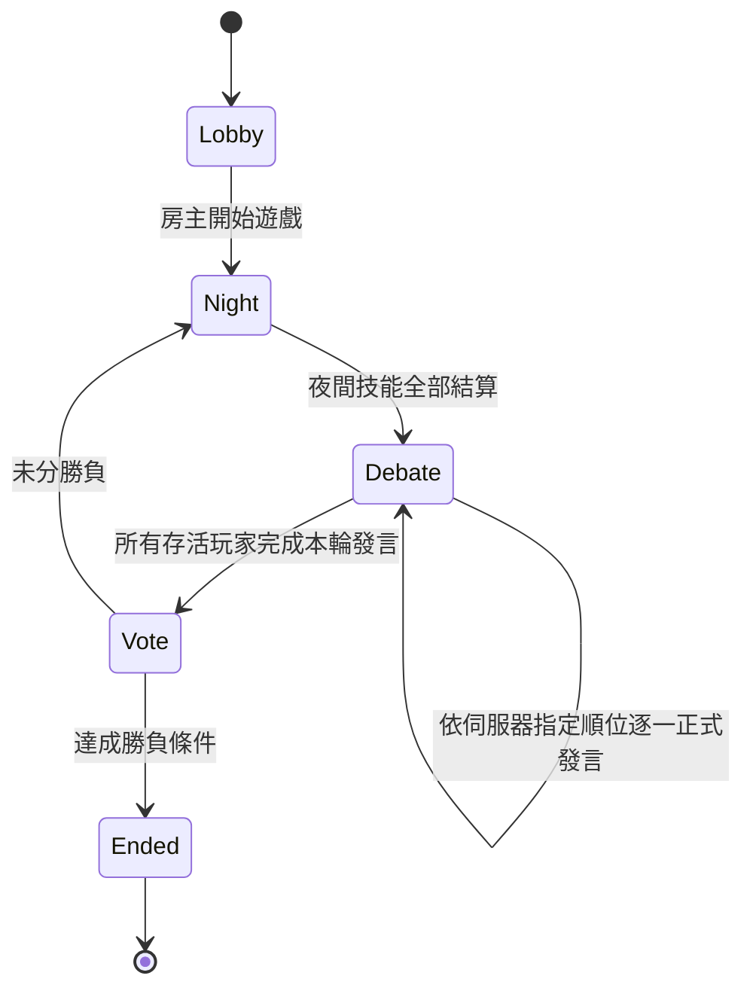
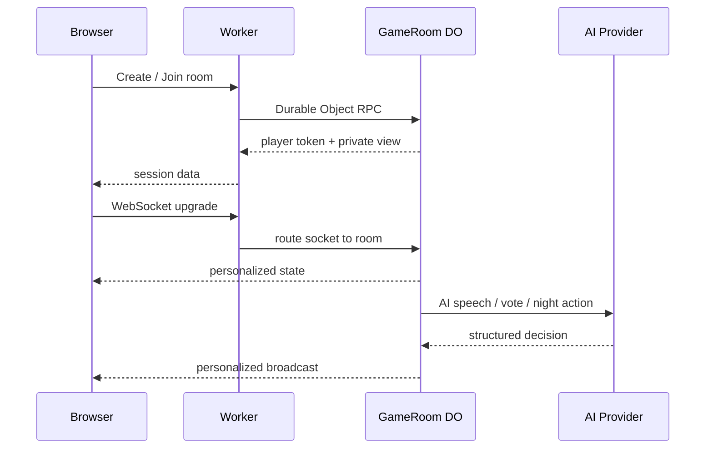

# 狼人議會 — AI 辯論式狼人殺 on Cloudflare Workers

**狼人議會**是一個專門為 **Cloudflare Workers** 設計的多人狼人殺 Web App。遊戲核心是「發言、推理、質疑、票型」的**辯論式狼人殺**，不是用武器互砍、追殺、碰撞或即時 PvP 淘汰玩家的暴民式玩法。

真人可以和 AI 同桌。AI 可接 OpenAI GPT、Google Gemini、DeepSeek，以及自訂 OpenAI-compatible API；沒有設定 API Key 時會自動退回本地規則型 bot，避免對局因外部 Provider 故障而中斷。

> 本專案為獨立實作。下方列出的巴哈姆特文章只作為玩法概念與規則取捨的參考；本 repository 不包含該 Minecraft 地圖／資料包的原始碼、指令檔、圖片或文章內容，也不表示與原作者有合作、授權或從屬關係。

---

## 1. 核心原則：只做辯論式，不做暴民式

本遊戲的白天不是自由混戰，也不是房主想按就直接開票。

每一個白天固定走以下流程：



### 1.1 Debate Gate（辯論閘門）

伺服器每個白天會重新排列所有存活玩家的正式發言順序。只有**目前輪到的玩家**能送出本輪正式發言；其他人只能閱讀紀錄、等待自己的順位。

在最後一位存活玩家完成發言前：

- 伺服器 phase 仍是 `debate`。
- 不接受放逐投票。
- 房主也沒有「強制開始投票」按鈕。
- AI 必須在自己的順位公開發言，不能跳過辯論直接喊票。

這個限制在 Durable Object 的 canonical state 上執行，不只靠前端按鈕隱藏，因此不能單純修改瀏覽器 JS 繞過。

### 1.2 正式發言不是隨機喊人

AI 的辯論 prompt 明確要求它根據可合法取得的資訊推理，例如：

- 前後發言是否矛盾。
- 誰在替誰站邊或迴避問題。
- 夜間死亡結果。
- 已公開的票型。
- 自己角色依法能知道的私密資訊。

AI 發言必須提出理由與立場／懷疑對象，而不是只輸出「我投 X」。

### 1.3 AI 不搶第一張真人票

當場上仍有至少一名存活真人時，AI 在 `vote` phase **至少等一名真人先完成投票**才會開始自動投票。若場上已無存活真人，AI 才可自行完成整個投票階段。

這可避免 AI 一進投票階段就瞬間把票型灌滿，保留真人玩家觀察、判斷與帶票的空間。

---

## 2. 遊戲規則

目前支援 **5–12 人**，真人與 AI 可以混合。

### 2.1 身份

| 身份 | 陣營 | 夜間能力 |
|---|---|---|
| 狼人 | 狼人 | 對一名存活玩家投擊殺票 |
| 村民 | 好人 | 無夜間技能，只能靠辯論與票型推理 |
| 預言家 | 好人 | 每晚查驗一名玩家陣營 |
| 女巫 | 好人 | 一次性解藥或一次性毒藥，每晚最多選一種行動 |
| 守衛 | 好人 | 每晚守護一名玩家；**不能連續兩晚守同一人** |

### 2.2 女巫自救限制

目前採用偏保守的配置：

- 10 人以下：只有第一晚可以用解藥自救。
- 11–12 人：不能自救。
- 解藥與毒藥各只有一次。
- 同一晚不能同時使用兩瓶藥。

### 2.3 夜間結算

夜晚由伺服器等待所有仍需行動的角色完成選擇，再一次結算：

1. 狼人共同決定主要擊殺目標。
2. 預言家記錄自己的查驗結果。
3. 守衛保護生效。
4. 女巫解藥／毒藥生效。
5. 計算死亡名單。
6. 檢查勝負。
7. 若尚未結束，進入下一個白天的正式辯論。

### 2.4 放逐投票

- 只有存活玩家可投票。
- 不能投自己。
- 每名存活玩家一票。
- 得票唯一最高者被放逐。
- 最高票平手時，本輪無人放逐。
- **所有存活玩家完成正式辯論之前完全不開票。**

### 2.5 勝利條件

- 所有狼人死亡：好人陣營勝利。
- 存活狼人數大於等於其餘存活玩家數：狼人陣營勝利。

---

## 3. Cloudflare 架構

```mermaid
flowchart LR
    B[Browser<br>Vanilla HTML / CSS / JS] <-->|HTTP + WebSocket| W[Cloudflare Worker]
    W -->|GAME_ROOM.getByName(roomCode)| DO[GameRoom Durable Object]
    DO --> DB[(Durable Object<br>SQLite Storage)]
    DO -->|server-side fetch| OAI[OpenAI Responses API]
    DO -->|server-side fetch| GEM[Gemini generateContent]
    DO -->|server-side fetch| DS[DeepSeek Chat Completions]
    DO -->|optional| COMPAT[OpenAI-compatible API]
    W --> ASSETS[Workers Static Assets]
```

### 3.1 為什麼是一房一個 Durable Object

每個房間都用自己的 `GameRoom` Durable Object：

- 同一房間只有一個 authoritative game state。
- 投票、夜間技能、發言順位可在同一協調單元中序列化。
- WebSocket 用 Hibernation API 維持即時狀態。
- SQLite storage 保存房間狀態，DO 被休眠／喚醒後仍能恢復。

不會用一個全域 Durable Object 處理所有房間，避免所有房間互相爭用同一瓶頸。

### 3.2 私密資訊隔離

瀏覽器**永遠拿不到完整 GameState**。

伺服器會根據 WebSocket 所屬玩家的 session token 產生個人化 projection：

- 一般玩家看不到別人的身份。
- 狼人只看得到依法能知道的狼人隊友資訊。
- 預言家只看得到自己的查驗結果。
- 女巫只看得到自己應知道的解藥／毒藥資訊。
- 守衛只看得到自己的上次守護資訊。
- AI 也只取得公開紀錄與自己角色合法知道的資訊。

---

## 4. JavaScript 與 Worker 原始碼

瀏覽器端完全是 **Vanilla JavaScript**，不需要 React、Vue 或前端 bundler：

```text
public/index.html
public/styles.css
public/app.js
```

Cloudflare Worker / Durable Object 原始碼使用 TypeScript（JavaScript 的型別化超集合），由 Wrangler 在部署時編譯成 Worker JavaScript；沒有 Node.js 常駐伺服器。

主要規則位於：

```text
src/game-engine.ts   # 純規則與可測函式
src/room.ts          # Durable Object、辯論流程、WebSocket、AI orchestration
src/ai.ts            # GPT / Gemini / DeepSeek adapters
src/index.ts         # Worker HTTP routing
```

---

## 5. AI Provider

截至 **2026-08-10**，repository 的預設值如下；房主新增 AI 時仍可自行填入其他有效 model ID。

| Provider | Repository 預設 model | Secret |
|---|---|---|
| OpenAI | `gpt-5.6-luna` | `OPENAI_API_KEY` |
| Gemini | `gemini-3.6-flash` | `GEMINI_API_KEY` |
| DeepSeek | `deepseek-v4-flash` | `DEEPSEEK_API_KEY` |
| OpenAI-compatible | 自行指定 | `CUSTOM_OPENAI_API_KEY` |

選擇這三個預設值的方向是「多人對局會頻繁呼叫，因此優先使用各家的快速／成本敏感型模型」，不是把 model ID 寫死在程式邏輯裡。

### 5.1 OpenAI

使用 Responses API：

```text
POST https://api.openai.com/v1/responses
```

### 5.2 Gemini

使用 `generateContent`：

```text
POST https://generativelanguage.googleapis.com/v1beta/models/{MODEL}:generateContent
```

### 5.3 DeepSeek

使用 OpenAI-compatible Chat Completions：

```text
POST https://api.deepseek.com/chat/completions
```

### 5.4 自訂 OpenAI-compatible Provider

在 Cloudflare Variables 設定：

```text
CUSTOM_OPENAI_BASE_URL=https://your-provider.example/v1
CUSTOM_OPENAI_MODEL_DEFAULT=your-model
```

程式會呼叫：

```text
${CUSTOM_OPENAI_BASE_URL}/chat/completions
```

### 5.5 Provider 失敗時

AI API 未設定、HTTP 失敗、格式錯誤或逾時時，該 AI 玩家會退回 server-side heuristic bot。遊戲流程不依賴任何一家外部模型一定成功。

---

## 6. 本機開發

需求：**Node.js 22**。

```bash
npm install
cp .dev.vars.example .dev.vars
npm run cf-typegen
npm run dev
```

Wrangler 啟動後，開啟它顯示的 localhost URL。

若要測 AI，只把實際需要的 Key 寫入 `.dev.vars`：

```dotenv
OPENAI_API_KEY="..."
GEMINI_API_KEY="..."
DEEPSEEK_API_KEY="..."
CUSTOM_OPENAI_API_KEY="..."
```

`.dev.vars` 已在 `.gitignore` 中，**不要 commit**。

---

## 7. 驗證

規則測試：

```bash
npm test
```

Cloudflare binding 型別 + TypeScript：

```bash
npm run typecheck
```

Wrangler 真實打包 dry-run：

```bash
npx wrangler deploy --dry-run --outdir .wrangler-dry-run
```

一次執行全部：

```bash
npm run verify
```

GitHub Actions：

```text
.github/workflows/verify.yml
```

會在 push / pull request 執行驗證。

---

## 8. 部署到 Cloudflare Workers

### 8.1 GitHub → Cloudflare Workers Builds

1. 在 Cloudflare Dashboard 開啟 **Workers & Pages**。
2. 建立 Worker，選擇從 Git repository 匯入。
3. 選擇本 repository。
4. Root directory 使用 repository root。
5. Build command 可使用：

```bash
npm install && npm test && npm run typecheck
```

6. Deploy command：

```bash
npx wrangler deploy
```

7. 部署完成後到 Worker 的 **Variables and Secrets** 加入你真正要使用的 AI keys。

### 8.2 Wrangler 直接部署

```bash
npx wrangler login
npx wrangler deploy
```

加入 Secrets：

```bash
npx wrangler secret put OPENAI_API_KEY
npx wrangler secret put GEMINI_API_KEY
npx wrangler secret put DEEPSEEK_API_KEY
npx wrangler secret put CUSTOM_OPENAI_API_KEY
```

只需要設定實際使用的 Provider。

---

## 9. HTTP / WebSocket 流程

前端透過 Worker API 建立或加入房間，之後主要狀態同步走 WebSocket。

高階資料流：



Session token 是房間憑證，不應交給其他人。

---

## 10. 專案結構

```text
.
├─ public/
│  ├─ index.html
│  ├─ styles.css
│  └─ app.js                 # 純瀏覽器 JavaScript UI
├─ src/
│  ├─ index.ts               # Worker HTTP API / static-assets routing
│  ├─ room.ts                # Durable Object / WebSocket / debate orchestration
│  ├─ game-engine.ts         # 純遊戲規則
│  ├─ ai.ts                  # GPT / Gemini / DeepSeek adapters
│  └─ types.ts
├─ test/
│  └─ game-engine.test.mjs
├─ .github/workflows/verify.yml
├─ SECURITY.md
├─ LICENSE
├─ wrangler.jsonc
└─ package.json
```

---

## 11. 安全設計

- API Key 只存在 Worker server-side Secrets。
- 不把完整房間狀態送到瀏覽器。
- 使用 Web Crypto 產生 session token／ID 所需的安全亂數。
- 房間 canonical state 在 Durable Object。
- AI prompt 有資訊邊界，不能直接看到其他身份。
- AI Provider failure 不會破壞 canonical game state。
- `.dev.vars`、`.env`、API Key 不應進 Git。

詳細內容：`SECURITY.md`。

---

## 12. 目前刻意未加入的功能

本版先把「辯論是否真的由伺服器強制」與 AI 混桌做好，因此暫時沒有：

- 語音聊天／TTS。
- 即時自由插話。
- 警長競選與 1.5 票。
- 獵人。
- 遺言回合。
- 狼人夜間私聊。
- 平票 PK 第二輪。
- 自訂角色組合。

這些若未來加入，也不應破壞 `Night → Debate → Vote` 的辯論式核心流程。

---

## 13. 玩法參考與獨立實作聲明

本專案在玩法設計階段參考以下公開討論，用來理解「暴民式」與「辯論式」的差異，以及 AI 混桌時應避免 AI 搶先完成投票的體驗問題：

1. 巴哈姆特 Minecraft 哈啦板：狼人殺重製版討論。  
   https://forum.gamer.com.tw/C.php?bsn=18673&snA=193576
2. 巴哈姆特 Minecraft 哈啦板：相關 AI 狼人殺回覆／討論。  
   https://forum.gamer.com.tw/Co.php?bsn=18673&sn=1078952

**Clean-room 原則：**

- 沒有複製該作品的資料包、函式、command、地圖、材質、圖片或程式碼。
- 沒有把文章大段文字搬進遊戲或 README。
- 只重新實作一般性的狼人殺流程、角色概念與上述玩法取捨。
- 原文章與相關作品的權利仍屬各自權利人。
- 本 repository 與上述作者／網站沒有官方關係。

---

## 14. 官方技術文件

- Cloudflare Workers: https://developers.cloudflare.com/workers/
- Durable Objects: https://developers.cloudflare.com/durable-objects/
- Durable Objects WebSockets: https://developers.cloudflare.com/durable-objects/best-practices/websockets/
- Workers Static Assets: https://developers.cloudflare.com/workers/static-assets/
- Workers Secrets: https://developers.cloudflare.com/workers/configuration/secrets/
- Cloudflare Git integration: https://developers.cloudflare.com/workers/ci-cd/builds/git-integration/github-integration/
- OpenAI API: https://developers.openai.com/api/
- Gemini API: https://ai.google.dev/gemini-api/docs
- DeepSeek API: https://api-docs.deepseek.com/

---

## 15. License — 極嚴格專有授權

**本專案不是 Open Source。**

Copyright © 2026 Ray20123315. All Rights Reserved.

除 GitHub Public Repository 服務條款依法／依平台契約必須保留的最低查看與 GitHub 內 fork 權限，以及適用法律不能排除的權利之外，`LICENSE` **沒有給一般使用者任何部署、執行、修改、散布、商用、SaaS、再授權、衍生作品或 AI 訓練／評測權利**。

要使用本專案，請先向 repository owner 取得明確書面授權。

完整條款以根目錄 `LICENSE` 為準。

> 注意：公開 GitHub repository 本身受 GitHub Terms of Service 約束；自訂 LICENSE 不能撤銷 GitHub 平台條款要求 public repository owner 提供的最低 GitHub 內查看／fork 權利。若需要連這類公開存取都避免，repository 應改為 Private。
