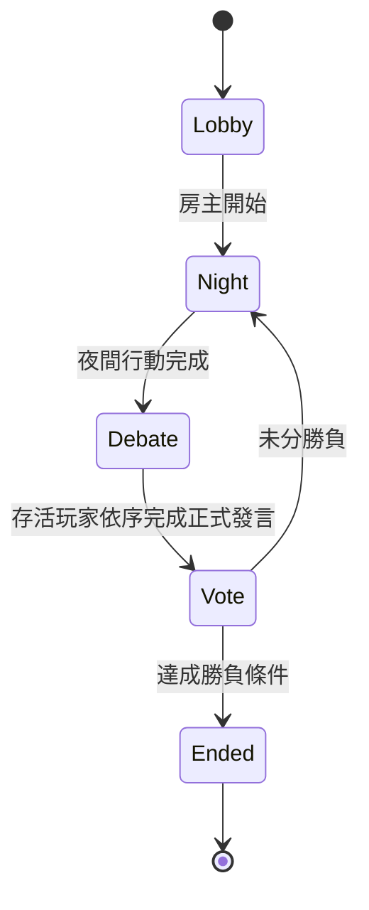

# 狼人議會 — Cloudflare Workers 即時多人狼人殺

**狼人議會**是一個部署在 Cloudflare Workers 的即時多人狼人殺 Web App。房間由 Durable Objects 協調，支援 WebSocket 即時同步、可設定角色、公開聊天，以及**選用**的 BYOK AI 玩家。

本版的核心原則是：**不強制 AI、不由部署者提供共享 AI API Key、不設定 5–12 人這種應用層硬上限。**

---

## 1. 功能

- 純真人房：完全不需要 AI 或任何 Provider API。
- BYOK AI：房主可選擇加入 OpenAI、Gemini、DeepSeek、OpenAI-compatible AI 玩家。
- API Key 由房主自己提供；不寫入 Durable Object state、GitHub、`wrangler.jsonc` 或 Worker Secrets。
- 即時公開聊天：大廳、白天辯論、投票與遊戲結束後可聊天；夜晚關閉公開聊天。
- 正式辯論：聊天不會推進發言順位，正式發言仍依伺服器指定順序完成。
- 可設定角色：房主在開始前設定狼人、村民，以及 0/1 名預言家、女巫、守衛。
- 無應用層固定玩家上限：加入房間不再檢查 `maxPlayers`；實際容量仍受 Cloudflare Durable Objects / WebSocket / CPU / memory / storage 平台限制。
- 伺服器權威狀態：角色、夜間技能、票型、辯論順位、勝負判定均由 Durable Object 處理。

---

## 2. 架構

```mermaid
flowchart LR
    B[Browser<br>HTML / CSS / JS] <-->|HTTP + WebSocket| W[Cloudflare Worker]
    W -->|GAME_ROOM.getByName(roomCode)| DO[GameRoom Durable Object]
    DO --> DB[(Durable Object SQLite)]
    W --> ASSETS[Workers Static Assets]
    H[Host browser<br>sessionStorage API key] -->|only when AI turn runs| W
    DO -->|transient provider request| AI[OpenAI / Gemini / DeepSeek / Compatible]
```

每個房間對應一個 `GameRoom` Durable Object。WebSocket 使用 Hibernation API，使房間在閒置時可休眠而不必斷線。

---

## 3. AI：選用 + BYOK

AI 不是開局條件。沒有 AI 的房間可以正常完成整場遊戲。

加入 AI 時，房主輸入：

- AI 名稱
- Provider
- Model
- 自訂 Provider 時的 HTTPS Base URL
- 房主自己的 API Key

API Key 的生命週期：

1. 瀏覽器把 Key 放在目前分頁的 `sessionStorage`。
2. Durable Object 只保存 AI 的 Provider / Model / Base URL，不保存 Key。
3. AI 輪到行動時，房主瀏覽器呼叫 `/api/rooms/:roomId/ai/run`，把 Key 只附在該次請求。
4. Worker / Durable Object 立即呼叫 Provider。
5. Key 不寫入 state、SQLite 或 console log。
6. 分頁／工作階段結束後需重新輸入 Key。

因此部署者不需要建立：

```text
OPENAI_API_KEY
GEMINI_API_KEY
DEEPSEEK_API_KEY
CUSTOM_OPENAI_API_KEY
```

---

## 4. 角色配置

目前角色：

| 角色 | 數量設定 | 說明 |
|---|---:|---|
| 狼人 | 1 以上 | 夜間共同選擇擊殺目標 |
| 村民 | 0 以上 | 無夜間技能 |
| 預言家 | 0–1 | 每晚查驗一名玩家陣營 |
| 女巫 | 0–1 | 一次解藥、一次毒藥 |
| 守衛 | 0–1 | 每晚守護，不能連守同一人 |

開始條件：

- 至少 3 名玩家。
- 角色總數必須等於玩家數。
- 至少 1 名狼人。
- 開局狼人數必須少於非狼人數。

新玩家／AI 加入大廳時，系統會先把新增名額補到村民；房主可以再調整。

---

## 5. 遊戲流程與聊天



公開聊天室與正式辯論是兩個概念：

- `chat`：自由聊天，不推進正式發言順位。
- `speech`：正式辯論內容，只有目前輪到的玩家可以送出，送出後才推進下一位。
- 夜晚不允許公開聊天。
- 對局進行中，出局玩家不能繼續公開發言。

---

## 6. 專案結構

```text
.
├─ public/
│  ├─ index.html
│  ├─ styles.css
│  └─ app.js
├─ src/
│  ├─ index.ts
│  ├─ room.ts
│  ├─ game-engine.ts
│  ├─ ai.ts
│  └─ types.ts
├─ test/
│  └─ game-engine.test.mjs
├─ .github/workflows/verify.yml
├─ SECURITY.md
├─ wrangler.jsonc
└─ package.json
```

---

## 7. 本機開發

需求：Node.js 22。

```bash
npm ci
npm run cf-typegen
npm run dev
```

本版不需要 `.dev.vars` AI secrets。

---

## 8. 驗證

```bash
npm test
npm run typecheck
npx wrangler deploy --dry-run --outdir .wrangler-dry-run
```

或一次執行：

```bash
npm run verify
```

GitHub Actions 也會在 `main` push / pull request 執行相同核心驗證。

---

## 9. 部署

```bash
npx wrangler login
npx wrangler deploy
```

也可以使用 Cloudflare Workers Builds 連接 GitHub repository，Production branch 指向 `main`。

部署後**不需要**替玩家設定任何 AI Provider Secret。使用 AI 的房主自行在遊戲 UI 輸入自己的 Provider Key。

---

## 10. 容量說明

UI 與遊戲邏輯不再設定 `maxPlayers`，因此不存在原本的 5–12 人硬限制。

但「沒有應用層上限」不代表物理上無限。單一房間仍是一個 Durable Object，會受到 Cloudflare 當下的 WebSocket、CPU、memory、storage、message size 與 overload 行為限制。若要做超大型公開房，應進一步把聊天紀錄／玩家資料正規化成多筆 SQLite rows，並做分區或 fan-out 設計。

---

## 11. 安全

請閱讀 `SECURITY.md`。重點：

- 不把 API Key commit 到 Git。
- BYOK Key 不持久化到房間 state。
- 自訂 OpenAI-compatible Base URL 必須使用 HTTPS。
- 玩家 session token 是房間憑證，不應分享。
- 瀏覽器拿到的是個人化 state projection，而不是完整 `GameState`。
