# 狼人議會 — Cloudflare Workers 辯論式狼人殺

**狼人議會**是一個部署於 Cloudflare Workers 的即時多人狼人殺 Web App。每個房間由一個 Durable Object 維護 authoritative state，前端使用 WebSocket 即時同步。

本專案只有一個玩法核心：**辯論式，不做暴民式。**

- 夜晚：角色秘密行動。
- 白天：公開資訊 → 依序正式發言 → 投票。
- 自由聊天不等於正式發言，也不能跳過 Debate Gate。
- 不實作武器、追逐、碰撞、距離、跑速、盔甲、隱形偷襲等 Minecraft 暴民式機制。
- 原作中只存在暴民式效果的角色仍保留角色名稱，但改寫為資訊／狀態機效果。

---

## 1. 房間與人物登入

房間可直接用 URL 分享：

```text
https://your-worker.example/ABC234
```

規則：

- 房號全域唯一，由伺服器產生 6 碼代碼。
- 房間密碼為**可選**。
- 真人「人物密碼」為**必填**，最少 4 個字元。
- 同一房間內名稱經 Unicode NFKC、空白正規化與不分大小寫比較後不可重複。
- 瀏覽器 session 還有效時重新整理會直接恢復人物。
- session 遺失、換瀏覽器或換裝置時，可用「房號 + 人物名稱 + 人物密碼」重新登入同一個人物。
- 成功重新登入會 rotate session token，舊連線立即失效。
- 房主踢人不是永久 Ban；名稱會釋放。對局進行中重新加入者只能觀戰，下一局才回到正式玩家，避免重新抽角色作弊。
- 升級前建立、尚未有人物密碼的舊人物，只要既有 token 還有效，UI 會要求補設人物密碼。

人物與房間密碼只保存 PBKDF2 verifier，不保存明碼。

---

## 2. 辯論式狀態機

```mermaid
stateDiagram-v2
    [*] --> Lobby
    Lobby --> Sheriff: 啟用警長
    Lobby --> Night: 未啟用警長
    Sheriff --> Night: 選舉完成
    Night --> Debate: 夜間結算完成
    Debate --> Vote: 所有必要正式發言完成
    Vote --> Debate: PK 平票追加發言
    Vote --> Vote: 全場重投
    Vote --> Night: 未分勝負
    Vote --> Reaction: 獵人／黑狼王／嫁禍者等反應
    Reaction --> Night
    Reaction --> Debate
    Vote --> Ended: 達成勝負條件
    Night --> Ended: 達成勝負條件
```



房主可以設定：

- 警長選舉開關。
- 死亡資訊：隱藏、只顯示死者、顯示死因。
- 平票：無人出局、全場重投、平票玩家 PK 正式發言後重投。

警長首輪平票會進第二輪；第二輪仍平票則本局無警長。現任警長死亡後，依得票候補順位由仍存活者繼任。

---

## 3. 角色系統

角色系統由 `src/roles.ts` 的資料驅動 Registry 管理，目前共有 **114 個 canonical 角色**。角色可重複配置，不再限制「特殊角色只能一名」。完整角色表見 `docs/ROLE_CATALOG.md`。

角色來源分三類：

- `official`：使用者提供的酷米狼人殺主文角色。
- `discussion`：同頁留言／後續角色提案。
- `adapted`：原效果主要依賴 Minecraft 暴民式物理互動，因此保留角色並明確改成辯論式資訊／狀態效果。

測試會鎖定 114 個 canonical IDs，且每一個 `adapted` 角色都必須有 `debateAdaptation` 說明；角色 Registry 中出現的每個主動 `effect` 也必須存在 server resolver 或核心技能路徑。

開局條件：

- 至少 3 名正式玩家。
- 配置角色總數必須等於正式玩家數。
- 至少一名狼人陣營。
- 開局狼人陣營數必須少於其他正式玩家總數。

應用程式不再設定固定最大玩家數；實際容量仍受 Cloudflare Durable Objects / WebSocket / CPU / memory / storage 平台限制。

---

## 4. 特殊資訊與結算

目前引擎包含：

- 狼刀、守護、女巫藥、查驗與偽裝。
- 雪狼／次雪狼／詐欺師／百變狼／潛伏狼等查驗干擾。
- 獵人、黑狼王、嫁禍者等 Reaction phase。
- 戀人、替身、肉盾、夢遊者、延遲死亡、復活、角色交換與陣營轉換。
- 怨靈、血族與第三方特殊勝負。
- 烏鴉票、抖M無效票、辨別者條件票、炸彈票、暴走狼累積票權。
- 警長與候補繼任。
- PK 辯論重投。
- 角色重複出現時的死亡反應 queue。

伺服器始終保存 canonical state；瀏覽器只收到該人物依法可知的 projection。

---

## 5. 公開聊天與正式發言

公開聊天與正式辯論分離：

- `chat`：自由交流，不推進發言順位。
- `speech`：只有目前輪到的玩家可以送出，送出後才推進 Debate Gate。
- 夜晚關閉公開聊天。
- 出局者與進行中觀戰者不能向存活玩家公開發言。
- 船長依角色設定知道全角色，但不進正式發言順序。

---

## 6. AI：完全選用 + BYOK

純真人房不需要任何 AI Provider。

若房主加入 AI：

1. 選 Provider / Model。
2. API Key 只放在房主目前瀏覽器 `sessionStorage`。
3. AI 輪到操作時，房主瀏覽器把 Key 隨該次 `/ai/run` request 傳給 Worker。
4. Durable Object 不把 Key 寫進 room state / SQLite / repository / Worker Secrets。
5. 分頁工作階段結束後必須重新輸入。

支援 OpenAI、Gemini、DeepSeek 與 HTTPS OpenAI-compatible endpoint。

---

## 7. 專案結構

```text
.
├─ public/
│  ├─ index.html
│  ├─ styles.css
│  └─ app.js
├─ src/
│  ├─ index.ts
│  ├─ room.ts
│  ├─ game-engine.ts
│  ├─ roles.ts
│  ├─ auth.ts
│  ├─ ai.ts
│  └─ types.ts
├─ docs/
│  └─ ROLE_CATALOG.md
├─ test/
│  └─ game-engine.test.mjs
├─ .github/workflows/verify.yml
├─ SECURITY.md
├─ wrangler.jsonc
└─ package.json
```

---

## 8. 本機開發與驗證

需求：Node.js 22。

```bash
npm ci
npm run cf-typegen
npm run dev
```

完整驗證：

```bash
npm run verify
```

等價核心 Gate：

```bash
npm test
npm run typecheck
npx wrangler deploy --dry-run --outdir .wrangler-dry-run
```

---

## 9. 部署

```bash
npx wrangler login
npx wrangler deploy
```

也可使用 Cloudflare Workers Builds 連接 GitHub，Production branch 指向 `main`。

本 repository 不需要部署者提供共享 AI API Key。

---

## 10. 安全

請閱讀 `SECURITY.md`。重點：人物／房間密碼不以明碼保存、token 會在重新登入時 rotate、BYOK Key 不持久化、完整角色與夜間秘密不直接送到一般瀏覽器。
