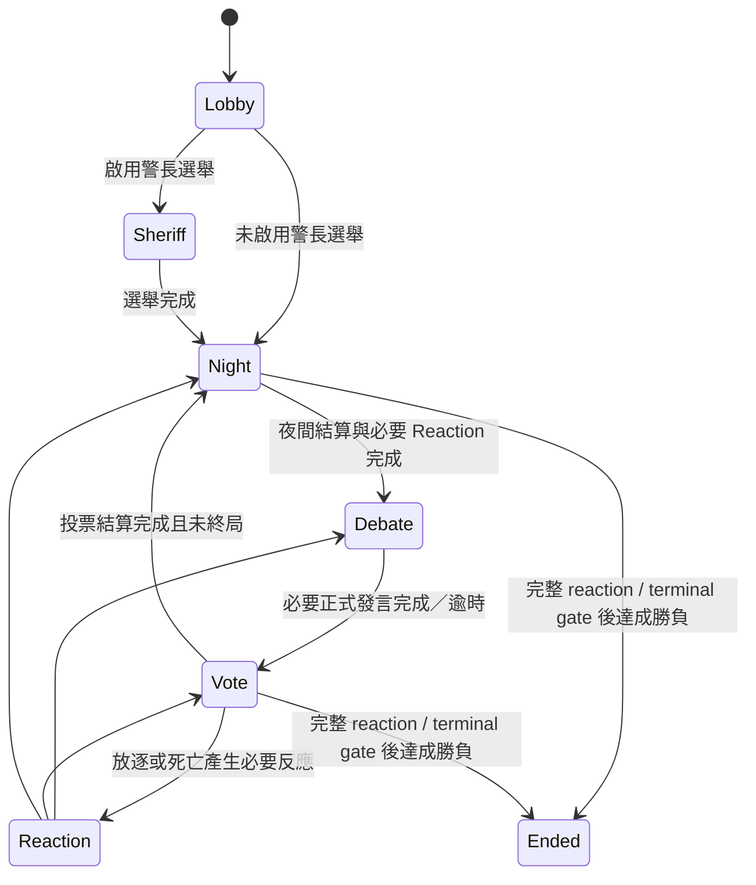

# 狼人殺 — Cloudflare Workers 辯論式狼人殺

**狼人殺**是一個部署於 Cloudflare Workers 的即時多人狼人殺 Web App。每個房間由 Durable Object 維護 authoritative state，前端透過 WebSocket 即時同步。

本專案只有一個產品玩法核心：**辯論式，不做暴民式。** 原作中依賴 Minecraft 武器、追逐、碰撞、距離、跑速、盔甲或隱形偷襲的效果，會改寫成可由伺服器驗證的資訊／狀態機規則。

---

## 1. 房間與登入

房間可直接以 URL 分享：

```text
https://your-worker.example/ABC234
```

- 房號由伺服器產生 6 碼代碼。
- 房間密碼可選；真人人物密碼必填。
- 同房名稱使用 Unicode NFKC、空白正規化與不分大小寫比較防止重複。
- 可用「房號 + 人物名稱 + 人物密碼」重新登入；成功後 session token 會 rotate。
- 房主踢人不是永久 Ban。進行中的對局重新加入者只能觀戰，下一局才重新成為正式玩家。
- 人物與房間密碼只保存 PBKDF2 verifier，不保存明碼。

---

## 2. 唯一狀態機與時間限制



房主可設定：

- 警長選舉開關。
- 死亡資訊：隱藏、只顯示死者、顯示死因。
- 勝負模式：`slaughter_edge`（屠邊）或 `slaughter_all`（屠城）。
- 白天、黑夜時間；預設各 **120 秒**，可自訂。
- 每組 CP 人數，最低 2 人。
- 蠢蛋 modifier 開關；開啟後每名正式玩家每局獨立 **25%** 機率成為蠢蛋。

Durable Object alarm 是 phase deadline 的權威來源。白天逾時會自動略過尚未完成的正式發言，未投票者記為棄票；夜晚逾時時尚未提交的操作安全視為 pass，再進行結算。

死亡、踢人或其他 roster mutation 後，runtime 會重新收斂目前 phase：已死亡／觀戰／被踢的辯論玩家不會卡住發言游標；最後一個待操作玩家被踢後，Night / Sheriff / Debate / Vote 也會重新判斷是否可完成。

---

## 3. Canonical 普通放逐投票

普通放逐只有一套規則：

- 每名存活、未被踢、非觀戰的正式玩家最多只有 **1 張普通放逐票**。
- 警長在普通放逐時也只有 **1 張票**；不存在 `A|B` 雙票或 `::sheriff2` pseudo ballot。
- 玩家可明確選擇 **棄票／跳過投票**。
- 角色效果可以讓一張票「有效或無效」，但**不能把單一玩家的普通放逐票加權成 2 票以上**。
- 所有人完成後立即建立 immutable `VoteSnapshot`，凍結有效票、棄票、無效票與各目標票數。
- 投票後才發生的陷阱、渡靈、死亡或其他連鎖不會回頭修改已經成立的投票事實。
- 最高票唯一者直接放逐；最高票並列時，只在**並列最高票者**中安全隨機抽一人出局。
- UI 與系統訊息會顯示各目標票數、棄票與無效票。

### 一人一票下的角色適配

- **抖M（附加身份）**：本人普通放逐仍是正常 **1 張票**；抖M的特殊性在自身被一般放逐時的個人勝利條件，不採用舊版「本人投票無效」。
- **辨別者**：投給好人陣營時該票無效。
- **烏鴉**：使目標翌日普通放逐票無效，不再新增額外票數。
- **炸彈狼**：炸彈持有者下一次實際投票時該票無效，且炸彈會傳給其投票目標；不再製造額外票數。
- **暴走狼**：成功狼刀累積一次狂暴；可消耗狂暴抵銷一次烏鴉／炸彈造成的無效票，但抵銷後仍只有 1 票。

Legacy weighted-vote、PK/revote 與警長第二張普通放逐票的 helper 只可作舊資料相容參考，**不屬於 composed runtime 的產品規則**。

---

## 4. 勝負、死亡與 Reaction

### 屠邊 `slaughter_edge`

狼人仍存活、場上沒有存活 spirit／怨靈，且好人方只剩 1 人或更少時，狼人陣營立即獲勝。

### 屠城 `slaughter_all`

狼人必須讓**所有其他陣營的存活正式玩家全部出局**才可獲勝，不套用屠邊提前終局。

### 終局與死亡順序

- Hunter、Black Wolf King 等 mandatory death reaction 必須先處理，再做 winner evaluation。
- Reaction queue 可處理同一次連鎖死亡產生的多個反應。
- 全部正式玩家同時出局時有明確 terminal state，不再留下 `winner === undefined` 的卡局。
- Neutral 個人勝利使用 `winnerPlayerIds` 指定真正勝者，不會把同 faction 的已死亡 Neutral 一併列入。
- **Red Axe Madman**：狼人全滅後仍可合法延續遊戲，因此一般「狼人為 0 → 村莊／怨靈勝」不能在它仍可行動時提前截斷對局。
- **Suicide Bomber**：白天自爆可指定 0～2 名其他存活玩家；若爆炸後場上沒有其他存活正式玩家，由炸彈客取得個人特殊勝利。

### 假死與魔術師

- **Fake Killer** 的假死是獨立狀態，不呼叫真死亡 pipeline，因此不會錯觸 Hunter 開槍、戀人殉情、警長繼任等真死亡副作用；下一輪自動恢復。
- **Magician**：每局一次選兩名其他玩家；一名真正死亡、一名仍屬存活狀態時，以正式死亡／復活 invariant 交換生死；兩人都活且在白天（Debate／Vote）時交換目前普通投票；其他有效情況（例如兩人都活但在夜晚、或兩人都真正死亡）交換職業與 `factionOverride`／勝利陣營歸屬。不能選自己。

---

## 5. 夜晚技能 resolver

Night runtime 先收集合法 submission，再讓控制類效果先於核心技能生效。最重要的 invariant：

```text
Submission / availability
        ↓
Disable / hide / redirect pre-stage
        ↓
Seer / Guard / Witch / generic role actions
        ↓
Kills / death chains
        ↓
Mandatory reactions
        ↓
Delayed / revive status
        ↓
Canonical winner gate
```

因此 Dream Wolf、Warlock nullify、Alchemist 等「本晚失效」效果，不會因 Seer／Guard／Witch 走不同程式路徑而出現一部分已先執行、一部分被封鎖的差異。

角色前置條件也由 server 決定 availability：

- Bee 只有 Hive 已死時才會出現一次性技能。
- Persuader Wolf 只有自己是最後一狼時才可轉化目標。
- Red Axe Madman 只有場上已無狼人時才取得夜殺。
- Sniper Eight Wolf 只在合法 cooldown 輪次顯示技能。
- Necromancer 只有達到死亡比例 milestone 才建立 action。

條件未成立時，不會向真人或 AI 顯示「可用技能」，也不會提前消耗 once-per-game 資源。

---

## 6. 角色、CP、蠢蛋與私人資訊

`src/roles.ts` 保留來源 registry；composed runtime 再套用 `CoreRules` 的產品級 canonical override。

- 新房與 reset 後，所有**目前 active 的產品角色**配置預設都為 1；實際開局仍依玩家數安全抽取合法板子。
- Gold Water / `confirmed_villager` 已從產品角色池與產品 allowlist 移除；舊房資料只做 migration 成 `villager`。
- `mimic_wolf`、`diviner` 目前也不在 active core pool，以避免與現有角色能力完全重複。
- 邱比特可依房主設定一次配對 N 名玩家成一個 CP 群組；同一玩家不能同時加入兩組 CP。
- CP 群組共享 lovers chat 與私人身分資訊；其中一人死亡時，其餘存活成員依戀人規則連鎖死亡。
- 自己永遠可在 private projection 看見自己的角色說明、主動技能時機與被動資訊。
- Hunter 在實際 pending death reaction 時可留下**一次**公開遺言。
- 啟用 Fool 後，每名正式玩家以 crypto RNG 獨立 25% 取得私人 Fool modifier。

角色名稱／固定遊戲文字使用 repository 內 `zh-TW`、`zh-CN`、`en` 靜態翻譯；不使用生成式 AI 翻譯固定內容。

---

## 7. AI：BYOK、合法性與多選項

純真人房不需要 AI Provider。若房主加入 AI：

1. 選 Provider / Model。
2. 每個 AI 可輸入 1～8 組 API Key；Key pool 只存在房主目前瀏覽器的 `sessionStorage`。
3. AI 操作時把該 AI Key pool 隨 `/ai/run` request 傳給 Worker。
4. Provider 憑證／配額／限流類錯誤才切換下一組 Key；規則錯誤不靠換 Key 重試。
5. Durable Object 不持久化 AI Key。

支援 OpenAI、Gemini、DeepSeek 與 HTTPS OpenAI-compatible endpoint。

AI runtime 規則：

- 沒有實際／合法操作的 AI 直接 zero-token skip，不阻塞 phase。
- 全部狼人都是 AI 且至少兩狼時，AI 狼會先進行受限的狼人秘密 council，再由唯一 wolf-kill leader 做最終刀口。
- 多 option 技能不再固定使用 `options[0]`。模型回傳結構化 `option + targetIds`，server 再以目前 role prompt、合法 option、合法目標與 target count 驗證。
- AI Sheriff 的普通放逐與真人一致，只回傳單一 `playerId`。

---

## 8. 聊天、翻譯與管理後台

### 公開／秘密聊天

- `chat` 是自由交流，不推進正式發言順位。
- `speech` 只有目前 debater 可以提交，才會推進 Debate Gate。
- 夜晚關閉公開聊天。
- 狼人與 CP 秘密聊天室只投影給依法可知的成員。
- 出局者與進行中觀戰者不能向存活玩家公開發言；Hunter 遺言是受限例外。

### 三語與玩家自由文字翻譯

- UI：`zh-TW`、`zh-CN`、`en`。
- 固定 UI、角色、系統、規則文字只用 repository-owned 靜態翻譯。
- 玩家 `chat` / `speech` 才使用遠端機器翻譯：Google `translate.googleapis.com` `client=gtx` 優先，MyMemory 僅作短文字 fallback。
- 不需要 `GOOGLE_TRANSLATE_API_KEYS`，也不使用 ChatGPT／Gemini 等生成式 AI 翻譯固定內容或玩家聊天。
- 詳細政策見 `docs/I18N_POLICY.md`。

### 管理後台

- `/admin` 使用 Worker Secret `ADMIN_PANEL_TOKENS` 的 Bearer Token。
- 可查看房間／診斷、公告、踢人與設定房內管理員。
- 不暴露人物密碼 verifier、session token、管理 Token 或玩家 BYOK AI Key。

---

## 9. 專案結構與驗證

主要 runtime：

```text
src/
├─ room.ts                 # legacy/base GameRoom engine
├─ game-engine.ts          # shared engine helpers
├─ roles.ts                # source role registry
├─ house-rules.ts          # multi-witch / wolf-leader / bounded AI chat
├─ equal-vote.ts           # canonical one-player-one-vote snapshot engine
├─ ai-flow.ts              # actionable AI scheduling / zero-token skips
├─ core-state.ts           # canonical settings, winner modes, default role pool
├─ core-relationships.ts   # multi-player CP
├─ core-phase-ai.ts        # phase timer / AI wolf council / Hunter last words
├─ core-integrity.ts       # phase/reaction/night/action cross-layer invariants
├─ core-terminal.ts        # final canonical terminal gate
├─ core-fake-death.ts      # fake-death vs true-death prerequisite invariants
├─ core-magician.ts        # final Word-source Magician semantics
├─ core-role-text.ts       # product text aligned with canonical runtime
└─ chat-channels.ts        # installs the composed runtime
```

`CoreRules` 是最後的 canonical convergence layer；測試必須同時驗證單元規則與最終組合 invariant，不能以「兩套互相衝突的單測各自都綠」當成產品正確。

需求：Node.js 22。

```bash
npm ci
npm run dev
```

完整 Gate：

```bash
npm run verify
```

等價核心步驟：

```bash
npm test
npm run typecheck
npx wrangler deploy --dry-run --outdir .wrangler-dry-run
```

---

## 10. 部署與安全

```bash
npx wrangler login
npx wrangler deploy
```

也可使用 Cloudflare Workers Builds 連接 GitHub，Production branch 指向 `main`。

本 repository 不需要部署者提供共享遊戲 AI API Key；AI 由房主 BYOK。玩家聊天翻譯也不需要 Google Cloud Translation API Key。

管理後台至少需要一組隨機管理 Token：

```bash
npx wrangler secret put ADMIN_PANEL_TOKENS
```

詳細安全規則見 `SECURITY.md`。核心原則：密碼不保存明碼、重新登入 rotate token、AI Key 不持久化、秘密角色與秘密聊天室只投影給合法觀看者、固定遊戲內容不送遠端翻譯、管理診斷會先去除常見 credential/token 形式。
